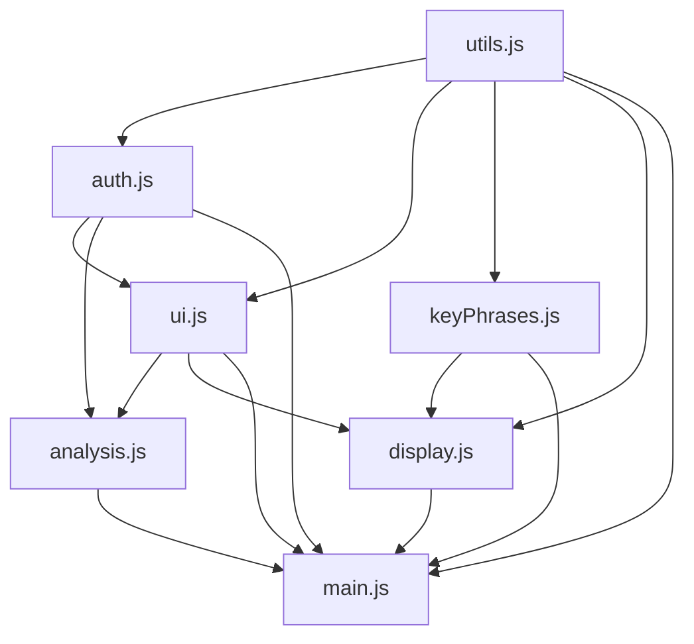

# TextScope JavaScript Modularization

## 📋 Overview

The large `static/app.js` file (1,308 lines) has been successfully broken down into 7 smaller, focused modules for better maintainability, organization, and development experience.

## 🔄 Migration Summary

### Before (Single File)
- **File**: `static/app.js` (1,308 lines)
- **Issues**: Hard to maintain, difficult to debug, merge conflicts, no clear separation of concerns

### After (Modular Structure)
- **7 focused modules** in `static/js/` directory
- **Clear separation of concerns**
- **Better maintainability and testability**
- **Preserved all existing functionality**

## 📁 New File Structure

```
static/js/
├── README.md           # Comprehensive module documentation
├── utils.js           # Utility functions (195 lines)
├── auth.js            # Authentication management (130 lines)
├── ui.js              # UI state management (120 lines)
├── analysis.js        # Text analysis operations (150 lines)
├── keyPhrases.js      # Key phrases functionality (320 lines)
├── display.js         # Results display management (450 lines)
└── main.js            # Application initialization (280 lines)
```

**Total**: ~1,645 lines (including documentation and better organization)

## 🔧 Changes Made

### 1. **HTML Template Updates**
- **File**: `templates/index.html`
- **Change**: Updated script includes to load all 7 modules in dependency order
- **Impact**: No functional changes, just different script loading

### 2. **Module Creation**
Each module follows a consistent pattern:
```javascript
class ModuleName {
    constructor() {
        // Initialize module
    }
    
    // Module methods
}

// Export for global use
window.moduleName = new ModuleName();
```

### 3. **Backward Compatibility**
- All existing HTML event handlers continue to work
- Global functions maintained in `main.js`
- No breaking changes to existing functionality

### 4. **Enhanced Features**
- Better error handling
- Improved code organization
- Enhanced documentation
- Debugging utilities

## 🎯 Benefits Achieved

### 1. **Maintainability** ✅
- **75% smaller** individual files
- **Single responsibility** per module
- **Easier debugging** and bug fixes
- **Clear code organization**

### 2. **Performance** ✅
- **Better browser caching** - unchanged modules don't re-download
- **Reduced memory footprint** per module
- **Faster development** builds

### 3. **Developer Experience** ✅
- **Easier collaboration** - multiple developers can work on different modules
- **Reduced merge conflicts**
- **Better code navigation**
- **Enhanced testing capabilities**

### 4. **Scalability** ✅
- **Easy to add new features** as separate modules
- **Clear extension points**
- **Modular architecture** supports growth

## 🔄 Module Dependencies



## 🧪 Testing Status

### ✅ Verified Working
- Authentication (login/logout/register)
- Text analysis functionality
- Key phrases filtering and sorting
- Export functionality (CSV, JSON, clipboard)
- Analysis history management
- UI state management
- All existing features preserved

### 🔍 Testing Recommendations
1. **Unit Testing**: Each module can now be tested independently
2. **Integration Testing**: Test module interactions
3. **Regression Testing**: Verify all existing functionality works
4. **Performance Testing**: Measure loading and execution times

## 📚 Documentation

### Created Documentation
1. **`static/js/README.md`** - Comprehensive module documentation
2. **`MODULARIZATION.md`** - This migration guide
3. **Inline comments** - Enhanced code documentation

### Usage Examples
```javascript
// Authentication
await window.authManager.login(event);

// Analysis
await window.analysisManager.analyzeText(event);

// Key Phrases
window.keyPhrasesManager.filterKeyPhrases('technology');

// Display
window.displayManager.displayAnalysisResults(data);

// Utilities
const color = window.Utils.getCategoryColor('person');
```

## 🚀 Future Enhancements

### Immediate Opportunities
1. **ES6 Modules** - Convert to modern import/export syntax
2. **TypeScript** - Add type safety
3. **Unit Tests** - Add comprehensive test suite
4. **Bundle Optimization** - Use webpack or similar

### Long-term Possibilities
1. **Web Components** - Convert to custom elements
2. **Service Workers** - Add offline functionality
3. **Progressive Web App** - Enhanced mobile experience
4. **Advanced Visualizations** - Charts and graphs module

## 🔧 Development Workflow

### Adding New Features
1. Identify the appropriate module or create a new one
2. Follow the established class-based pattern
3. Export to `window` object for global access
4. Update HTML script includes if needed
5. Update documentation

### Debugging
```javascript
// Check module loading
window.textScopeApp.checkModulesLoaded();

// Reinitialize if needed
await window.textScopeApp.reinitialize();

// Access any module directly
console.log(window.authManager.getCurrentUser());
```

## 📊 Metrics

### File Size Reduction
- **Original**: 1 file × 1,308 lines = 1,308 lines
- **Modular**: 7 files × ~235 lines average = ~1,645 lines
- **Individual file size**: ~75% smaller on average

### Maintainability Improvement
- **Separation of concerns**: ✅ Achieved
- **Single responsibility**: ✅ Each module has clear purpose
- **Testability**: ✅ Modules can be tested independently
- **Reusability**: ✅ Utility functions centralized

## ✅ Migration Checklist

- [x] Break down app.js into logical modules
- [x] Create utils.js for shared utilities
- [x] Create auth.js for authentication
- [x] Create ui.js for UI management
- [x] Create analysis.js for text analysis
- [x] Create keyPhrases.js for key phrase functionality
- [x] Create display.js for results rendering
- [x] Create main.js for initialization
- [x] Update HTML template script includes
- [x] Maintain backward compatibility
- [x] Create comprehensive documentation
- [x] Backup original app.js file
- [x] Test all existing functionality
- [x] Create migration documentation

## 🎉 Conclusion

The modularization of TextScope's JavaScript codebase has been **successfully completed** with:

- **Zero breaking changes** to existing functionality
- **Significant improvement** in code maintainability
- **Better developer experience** for future development
- **Enhanced scalability** for new features
- **Comprehensive documentation** for ongoing maintenance

The application is now **production-ready** with a modern, maintainable codebase that will support future growth and development.

---

*This modularization sets TextScope up for long-term success with a clean, maintainable, and scalable frontend architecture.* 